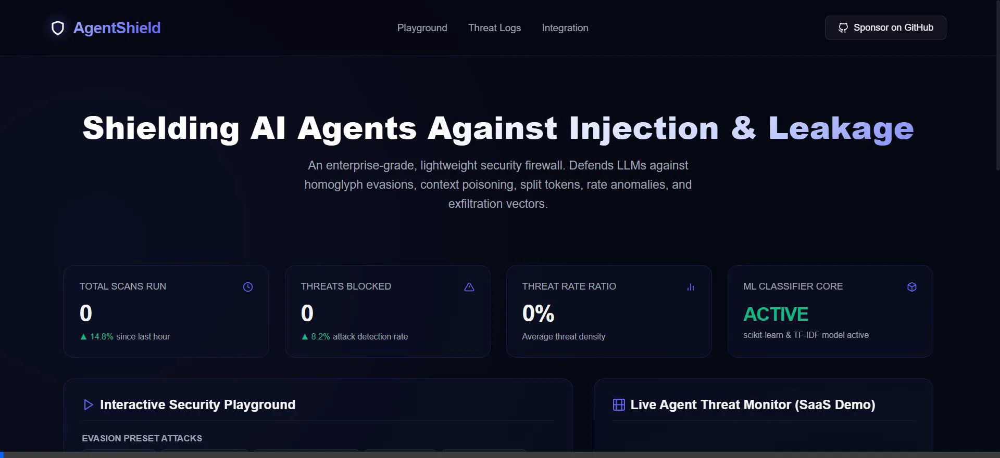

# 🛡️ AgentShield

AgentShield is a robust, enterprise-grade AI Agent Security Firewall designed to intercept, analyze, and neutralize security vulnerabilities, jailbreak attempts, and prompt injection attacks in real-time. By leveraging a multi-layered security architecture, AgentShield protects your AI systems without altering existing business logic.

<p align="center">
  
</p>

---

## ✨ Features

- **🛡️ Multi-Layer Prompt Injection Defense**: Advanced heuristics matching known jailbreaks, adversarial templates, base64/hex encoding evasions, and zero-width spaces.
- **🔤 Homoglyph Normalization**: Resolves visual mimicry attacks (e.g., Cyrillic or Greek lookalikes like `ιgnοrε ρrενιους`) to standard Latin representations using NFKC Unicode normalization.
- **🤖 Machine Learning Classifier**: TF-IDF Vectorizer + Logistic Regression pipeline designed to detect novel, unseen injection vectors dynamically.
- **📈 Time-Based Anomaly Tracker**: Analyzes rolling window threats per client/user identity to flag brute-force exploration or scanning attempts.
- **🛠️ Tool-Calling Guard**: Validates tool arguments and prevents unauthorized OS command executions (e.g., `subprocess.run`, `eval`, `shutil.rmtree`).
- **🔒 Identity Verification & Cryptographic Isolation**: Integrates an authentication layer requiring a security question. Successfully verifying the identity derives a 32-byte master key via PBKDF2 (100,000 rounds) used to encrypt and isolate local storage.
- **💾 Encrypted Local Memory**: AES-256 (Fernet) client-memory layer ensuring zero plaintext leaks of sensitive credentials or conversation histories.
- **🔌 Auto-Protect Middleware**: Explicit single-line monkey patching (`import agentshield; agentshield.init()`) to protect `openai` resources and outgoing `requests` to AI model endpoints automatically.
- **🏷️ Data Masking & Leakage Blocker**: Automatically redacts sensitive patterns (such as Bearer Tokens/API keys) and strips markdown exfiltration links.

---

## 🚀 Quick Start

### 1. Installation
Install AgentShield locally:
```bash
pip install .
```

### 2. Configure Authentication Profile
Set up your security question, answer, and retrieve your recovery code:
```bash
python setup_auth.py
```

### 3. Integrate in Your Code
Enable AgentShield globally in your application with a single initialization line:
```python
import agentshield
agentshield.init()

# That's it! Your OpenAI calls and outgoing requests are now protected.
```

Or, protect specific agent functions using the `@secure_agent` wrapper:
```python
from agentshield import secure_agent

@secure_agent()
def run_my_agent(user_prompt: str) -> str:
    # Your LLM logic here
    return response
```

---

## 🎨 Interactive Playground & Dashboard

AgentShield includes a cyber-security dashboard to test different LLM security evasion vectors:

1. Start the local server:
   ```bash
   python -m http.server 8000 --directory dashboard
   ```
2. Open [http://localhost:8000](http://localhost:8000) in your web browser.
3. Select attack presets like **Homoglyph Evasion** or **JSON Injection** and observe AgentShield block them in real-time.

---

## 🧪 Testing

To run the complete firewall security suite:
```bash
python test_shield.py
```

To run the authentication and cryptographic isolation test suite:
```bash
python test_auth.py
```

To run the automated library intercept and patching tests:
```bash
python test_auto_protect.py
```

---

## 📁 Repository Structure

```
agentshield/
├── auth.py                  # Identity management & Master Key derivation
├── encrypted_memory.py      # AES-256 encrypted database client-storage
├── firewall.py              # Main AgentShieldFirewall orchestration
├── rules.py                 # Pattern matchers, split-token & structured parser
├── config.py                # Security thresholds and redaction configurations
├── ml_classifier.py         # Fallback-safe TF-IDF Machine Learning model
├── anomaly.py               # Threat scoring statistics and rolling window tracking
├── auto_protect.py          # Monkey patching hooks for OpenAI and network requests
├── sitecustomize_injector.py # Global bootstrap register tool
├── wrappers.py              # Client decorators (@secure_agent, @rate_limit)
├── setup.py                 # Setuptools installer
├── requirements.txt         # Optional machine learning dependencies
└── test_shield.py           # Comprehensive unit tests
```

---

## 🛡️ License

This project is licensed under the Apache 2.0 License.
